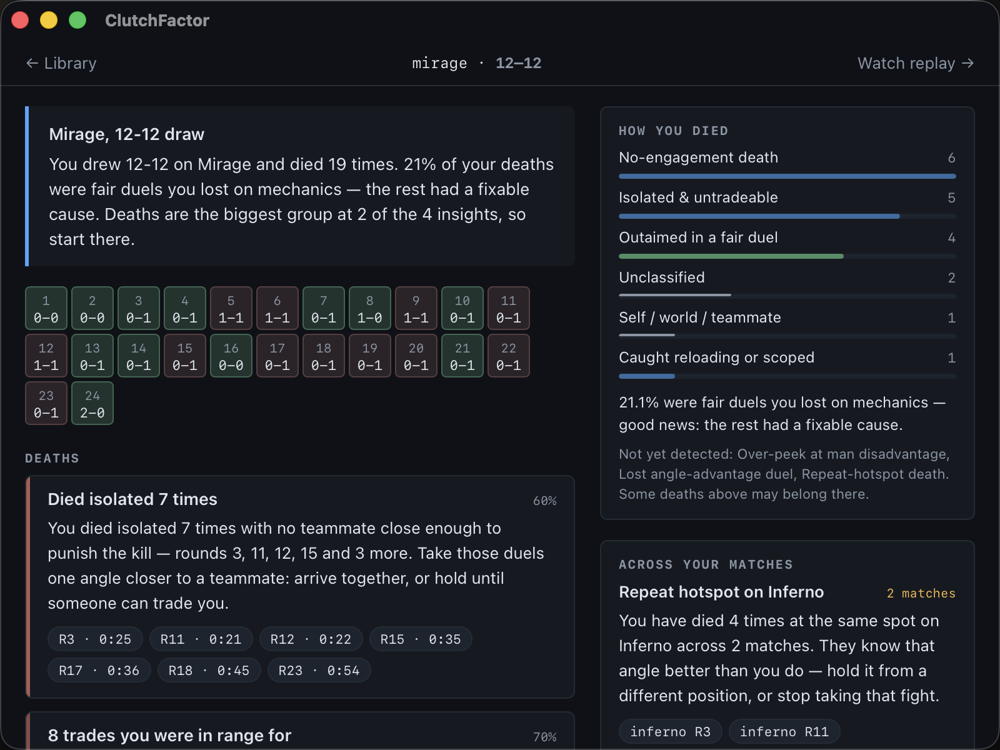
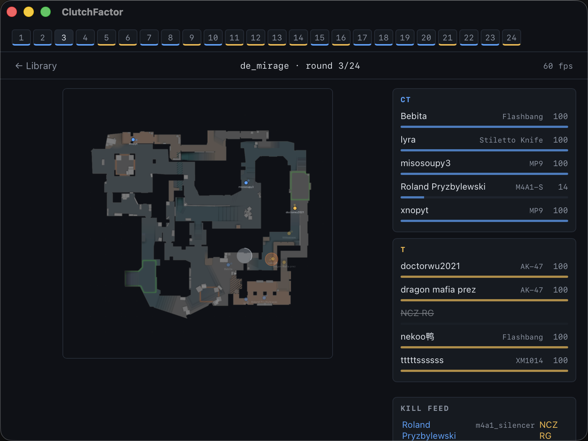
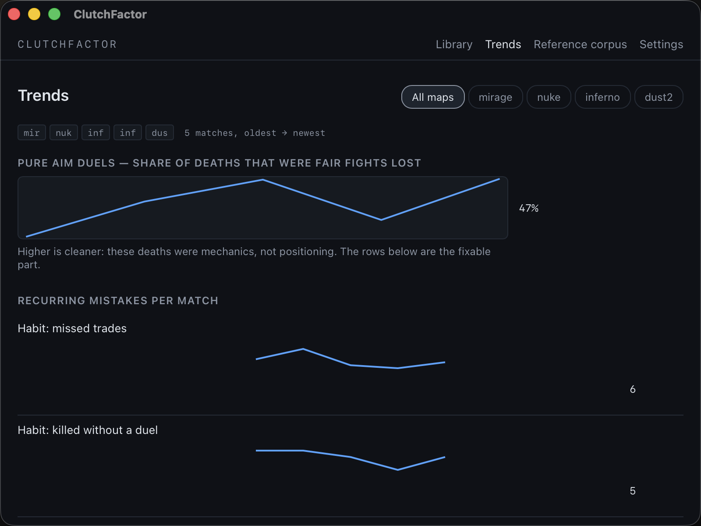
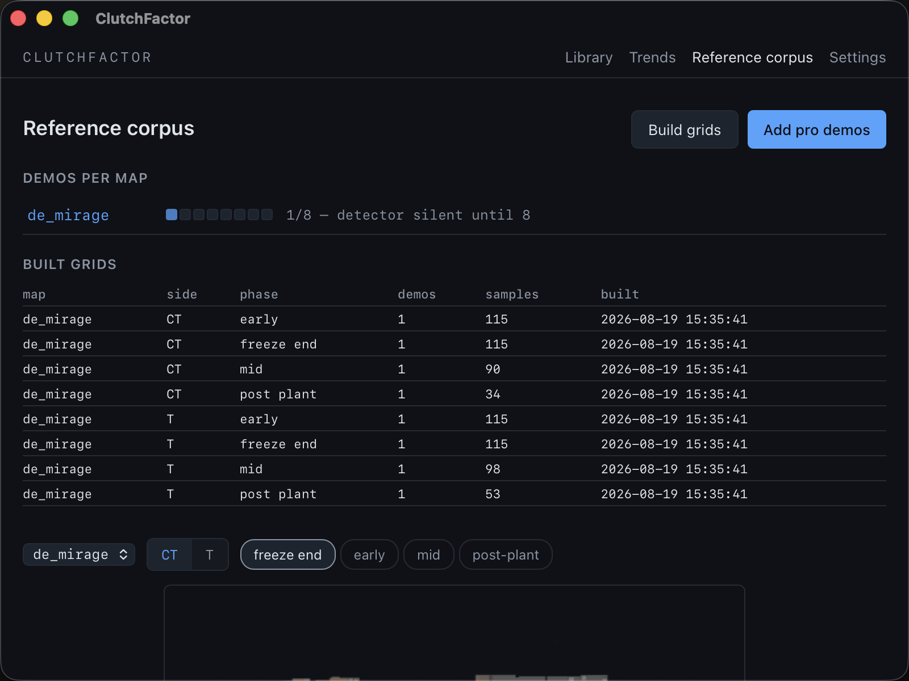
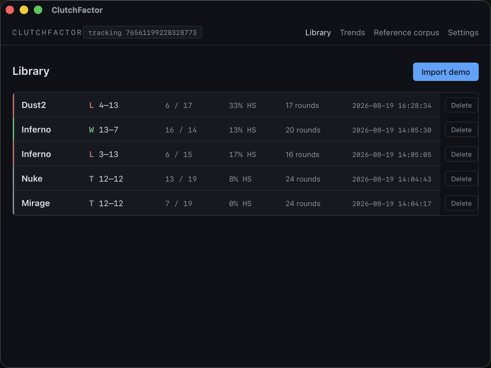

# ClutchFactor

Desktop CS2 coaching app. Import your own matchmaking or FACEIT demos (`.dem`)
and get coaching you can *watch*: every insight links to the exact rounds and
seconds in a 2D replay, so you can see the mistake instead of taking a stat's
word for it. It is a coach, not a stats tracker.



## What it does

- **Match report** — a narrated insight feed ("You died isolated 7 times with
  no teammate close enough to punish the kill — rounds 3, 11, 12…"), a
  15-class breakdown of *how* you died (one primary cause per death,
  priority-ordered), and a round strip. Every card carries evidence chips
  that open the replay at the right tick.
- **2D replay** — radar playback of any round at 60 fps: positions, health,
  weapons, kill feed, deaths. Deep-linked from every insight.
- **Cross-match habits** — patterns promoted only when they repeat ("Left
  trades on the table in 5 of your last 10 matches"), including repeat death
  hotspots per map, with evidence into each contributing demo.
- **Trends** — per-habit sparklines across your imported matches, the share
  of deaths that were pure aim duels, and streak callouts ("Good news:
  isolated deaths trending down 4 matches straight").
- **Reference corpus** — drop pro demos (freely downloadable from HLTV match
  pages) into the corpus and the app builds positional occupancy heatmaps
  per map/side/round-phase. With 8+ pro demos on a map, it flags spots you
  hold that reference players rarely do. Statistically honest by design:
  the wording is "unusual, not wrong", and below 8 demos it stays silent.






## The analysis, honestly

Deaths are classified by a rule engine (families H1–H16 over parsed demo
events: positions, trades, utility, timing) with documented thresholds —
never scattered magic numbers. Rules bias toward silence: a missed detection
is fine, a wrong accusation is not, and every rule carries a confidence.
Deaths the engine can't attribute stay "Unclassified" and the report says
so. Geometry-level analysis (raycast line-of-sight, "crosshair placement")
is out of scope for v1 — nothing here pretends otherwise.

## Install

Grab the latest release from the
[releases page](../../releases):

- **Windows** — the `.exe` NSIS installer (or `.msi`). SmartScreen will warn
  because the build is unsigned: "More info → Run anyway".
- **macOS** (Apple silicon) — the `.dmg`. Unsigned: right-click the app →
  Open on first launch.

Then: **Import demo** → pick a `.dem` from your own matches (CS2 → Watch →
Your Matches → Download, or FACEIT match room). The app auto-detects which
player you are (most-seen account across your imports) — override it in
Settings if it guesses wrong.

## Development

Prereqs: Rust stable (rustup), Node 22, pnpm 10. See `CLAUDE.md` for the
full command list.

```sh
pnpm install
pnpm tauri dev                                  # run the app
pnpm typecheck && pnpm lint && pnpm test:run    # frontend checks
cargo test --manifest-path src-tauri/Cargo.toml --workspace
```

Architecture: `cf-parser` (demoparser2 wrapper → normalized match data) →
`cf-analysis` (pure detectors) → `cf-store` (SQLite) → Tauri commands →
React/canvas frontend. Real demos live in `fixtures/` (gitignored — see
`fixtures/README.md`). Radar images vendored from
[awpy](https://github.com/pnxenopoulos/awpy) (see
`assets/maps/ATTRIBUTION.md`).
